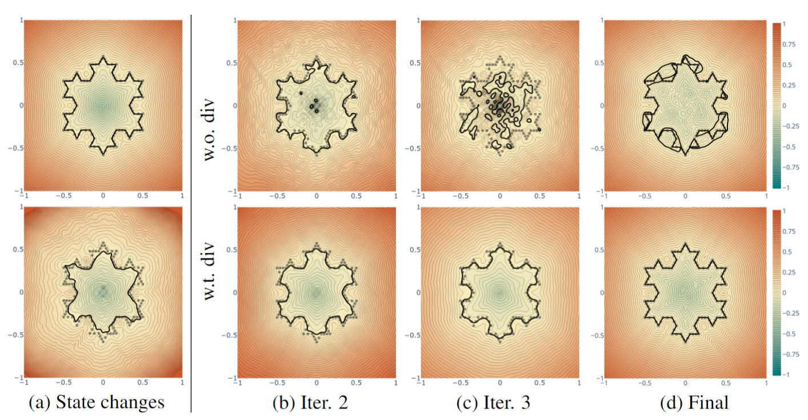

***StEik***: Stabilizing the Optimization of Neural Signed Distance Functions and Finer Shape Representation (NeurIPS 2023)
---
Created by [Huizong Yang*](https://www.linkedin.com/in/huizong-yang/), [Yuxin Sun*](https://www.linkedin.com/in/yuxin-sun-972960140/), [Ganesh Sundaramoorthi](http://www.ganeshsun.com/index.html) and [Anthony Yezzi](https://ece.gatech.edu/directory/anthony-joseph-yezzi) from [Georgia Tech](https://www.gatech.edu/) and [Raytheon Technologies](https://www.rtx.com/).

__[Arxiv](https://arxiv.org/abs/2305.18414)__



## Introduction
This is the code for training shape INRs for 3D surface reconstructions from point cloud using our new second order regularization and new shape representation.
It allows to train, test and evaluate the tasks of surface reconstruction.

Please follow the installation instructions below.

## Instructions

### 1. Requirements

Our codebase uses [PyTorch](https://pytorch.org/).

The code was tested with Python 3.9.12, torch 1.8.2, tensorboardX 2.3, CUDA 11.7 on Red Hat 4.8.5-44 (should work with later versions).
For a full list of requirements see [the `requirement.txt` file](requirements.txt). Note we also use `plotly-orca` for visualisation, which needs to be installed from conda.

Example installation code (should install PyTorch separately):
```sh
conda create -n steik python=3.9.12
conda activate steik
conda install pip # for using pip commands in the conda env
pip install -r requirements.txt
conda install -c plotly plotly plotly-orca # conda only 
# Install with instructions from https://pytorch.org/get-started/locally/
# Below is instructions for installation of long term support (1.8.2 at the time).
conda install pytorch torchvision torchaudio cudatoolkit=11.1 -c pytorch-lts -c nvidia
# for CUDA 10.2: conda install pytorch torchvision torchaudio cudatoolkit=10.2 -c pytorch-lts
```

###  2. Testing on 2D Shapes (No External Data required)

We implemented a 2D shape dataset generator (`./sanitychecks/basic_shape_dataset2d.py`) that includes three shapes: Circle, L shape polygon, and Koch snowflake. The code generally allows any polygonal shape to be used and can be extended to other 2D shapes. 

To train a 2D shape neural representation and reconstruct the surface (curve in this case) for all three shapes run the script 
```sh
cd sanitychecks
./scripts/run_train_test_basic_shape.sh
```

To visualize the MFGI and geometric initializations run `./sanitychecks/scripts/visualize_initializations.sh`

### 3. Surface Reconstruction (and Scene Reconstruction)
#### 3.1 Data for Surface Reconstruction
##### 3.1.1 Surface Reconstruction Benchamark data
The Surface Reconstruction Benchmark (SRB) data is provided in the [Deep Geometric Prior repository](https://github.com/fwilliams/deep-geometric-prior).
This can be downloaded via terminal into the data directory by running `data/scripts/download_srb.sh` (1.12GB download). We use the entire dataset (of 5 complex shapes).

If you use this data in your research, make sure to cite the Deep Geometric Prior paper.

##### 3.1.2 ShapeNet data
We use a subset of the [ShapeNet](https://shapenet.org/) data as chosen by [Neural Splines](https://github.com/fwilliams/neural-splines). This data is first preprocessed to be watertight as per the pipeline in the [Occupancy Networks repository](https://github.com/autonomousvision/occupancy_networks), who provide both the pipleline and the entire preprocessed dataset (73.4GB). 

The Neural Spline split uses the first 20 shapes from the test set of 13 shape classes from ShapeNet. We provide [a subset of the ShapeNet preprocessed data](https://drive.google.com/file/d/1h6TFHnza0axOZz5AuRkfyLMx_sFcu_Yf/view?usp=sharing) (the subset that corresponds to the split of Neural Splines) and [the resulting point clouds for that subset](https://drive.google.com/file/d/14CW_a0gS3ARJsIonyqPc5eKT3iVcCWZ0/view?usp=sharing). These can be downloaded via terminal into the data directory by running `data/scripts/download_shapenet.sh`  (783.76MB download).

If you use this data in your research, make sure to cite the ShapeNet and Occupancy Network papers, and if you report on this split, compare and cite to the Neural Spline paper.

##### 3.1.3 Scene Reconstruction data
For scene reconstruction, we used the [scene from the SIREN paper](https://drive.google.com/drive/folders/1_iq__37-hw7FJOEUK1tX7mdp8SKB368K?usp=sharing). This can be downloaded via terminal into the data directory by running `data/scripts/download_scene.sh`  (56.2MBMB download).

If you use this data in your research, make sure to cite the SIREN paper.

#### 3.2 Running Surface Reconstruction
To train, test and evaluate on SRB run 

```./surface_reconstruction/scripts/run_surf_recon_exp.sh```

Similarly we provide a script for ShapeNet: 

```./surface_reconstruction/scripts/run_shapenet_recon.sh```

and for scene reconstruction 

```./surface_reconstruction/scripts/run_scene_recon_exp.sh``` 

These scripts have bash variables for changing the input, major hyperparameters, and where saves/logs/meshes are made.

## Thanks

Thanks to the [DiGS](https://github.com/Chumbyte/DiGS) codebase off whom we built upon. 

Supported in part by Army Research Office (ARO) W911NF-22-1-0267 and by the Intelligence Advanced Research Projects Activity (IARPA) via Department of Interior/ Interior Business Center (DOI/IBC) contract number 140D0423C0075. The U.S. Government is authorized to reproduce and distribute reprints for Governmental purposes notwithstanding any copyright annotation thereon. Disclaimer: The views and conclusions contained herein are those of the authors and should not be interpreted as necessarily representing the official policies or endorsements, either expressed or implied, of IARPA, DOI/IBC, or the U.S. Government.

## License and Citation

If you find our work useful in your research, please cite our paper:

[Preprint](https://arxiv.org/abs/2305.18414):
```bibtex
@misc{yang2023steik,
      title={StEik: Stabilizing the Optimization of Neural Signed Distance Functions and Finer Shape Representation}, 
      author={Huizong Yang and Yuxin Sun and Ganesh Sundaramoorthi and Anthony Yezzi},
      year={2023},
      eprint={2305.18414},
      archivePrefix={arXiv},
      primaryClass={cs.CV}
}
```

See [LICENSE](LICENSE) file.